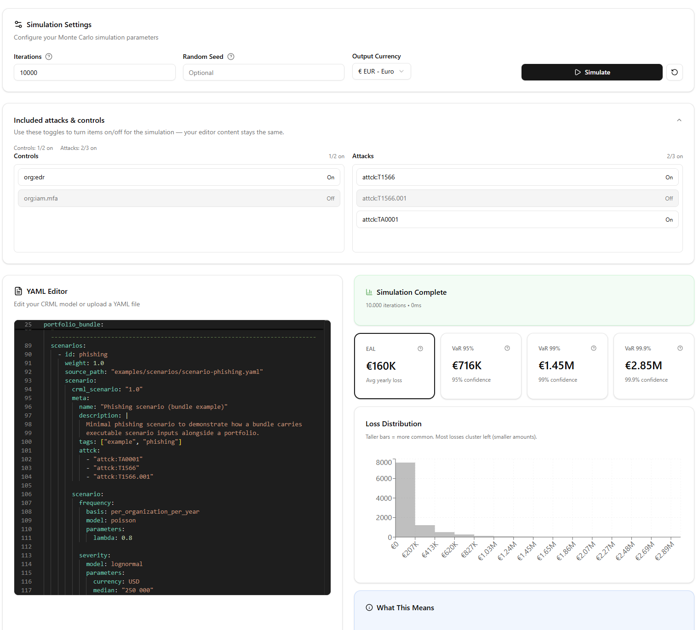
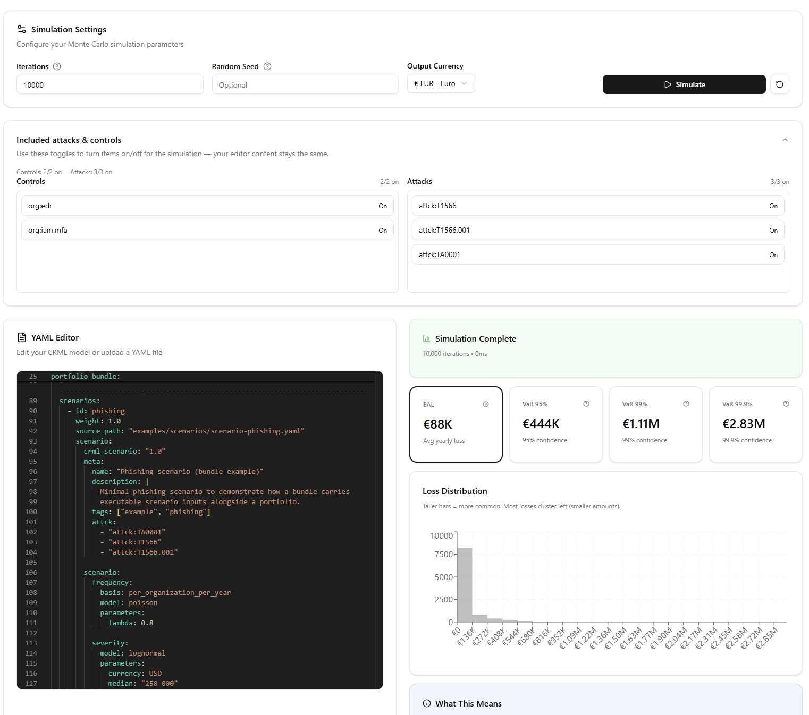
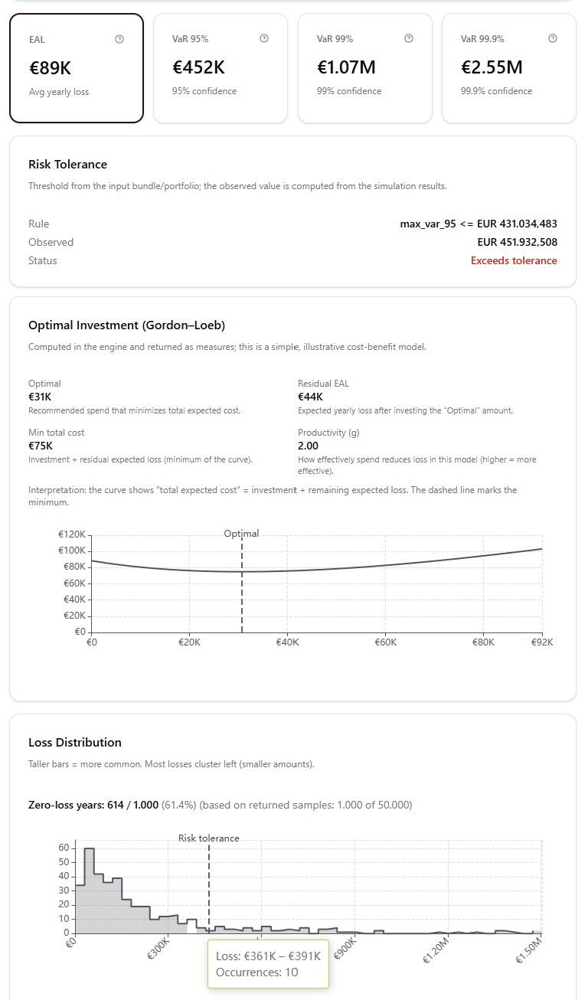
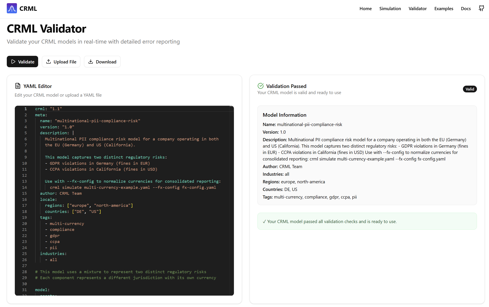

# CRML — Cyber Risk Modeling Language

[](https://pypi.org/project/crml-lang/)
[](https://pypi.org/project/crml-engine/)
[](https://www.python.org/downloads/)
[](https://opensource.org/licenses/MIT)

> **Status:** Draft. This project is under heavy development and may change without notice.
> We welcome input, issues, and contributions.

**Draft version:** 1.3.0

**Maintained by:** Zeron Research Labs and CyberSec Consulting LLC

**Supported by:**

- Community contributors and early adopters

CRML is an open, declarative, **engine-agnostic** and **Control / Attack framework–agnostic** Cyber Risk Modeling Language.
It provides a YAML/JSON format for describing cyber risk models, telemetry mappings, simulation pipelines, dependencies, and output requirements — without forcing you into a specific quantification method, simulation engine, or security-control / threat catalog.

CRML enables **RaC (Risk as Code)**: risk and compliance assumptions become versioned, reviewable artifacts that can be validated and executed consistently across teams and tools.

## Problem statement (what CRML is solving)

Cyber security, compliance, and risk management professionals often face the same practical problems:

- Risk models are locked in spreadsheets, slide decks, or proprietary tools, making them hard to review, audit, reproduce, and automate.
- Control effectiveness and “defense in depth” assumptions are documented inconsistently, so results vary by analyst and by quarter.
- Threat and control frameworks (e.g., ATT&CK, CIS, NIST, ISO, SCF, internal catalogs) change over time; do not provide a consistent machine readable format; mappings are brittle and rarely versioned.
- Quantification engines differ (FAIR-style Monte Carlo, Bayesian/QBER, actuarial models, internal platforms), causing costly rewrites and re-interpretation.
- Audit-ready evidence is fragmented: “what was modeled, with which parameters, using which data, and producing which outputs” is hard to prove.

CRML addresses this by standardizing the *description* of cyber risk models and their inputs/outputs, so different engines and organizations can exchange and execute the same model with clear validation and traceability.

## Why qualitative assessments aren’t enough

Qualitative methods (red/amber/green, “high/medium/low”, maturity scores) are useful for communication and prioritization, but they tend to break down when you need to:

- Justify security spend (or a new security product) by comparing expected risk *with* vs. *without* the investment
- Compare risk consistently across business units, vendors, or time periods
- Show measured risk reduction from controls (not just “improved posture”)
- Connect cyber risk to enterprise risk, insurance, and financial planning
- Produce repeatable, audit-ready evidence of “how we calculated this number”

The next evolution is **quantified risk management**: treating cyber risk as an estimable distribution of outcomes, grounded in explicit assumptions and data, and computed by repeatable methods.
But quantified approaches only scale when models are **standardized** — so they can be validated, reviewed, reused, and executed across tools and teams.

CRML’s goal is to be this standard: it makes the model *portable*, the assumptions *explicit*, and the results *reproducible*.

## Key features

- Control effectiveness modeling — quantify how controls reduce risk (including defense-in-depth)
- Median-based parameterization — specify medians directly for lognormal distributions
- Multi-currency support — model across currencies with automatic conversion
- Auto-calibration — calibrate distributions from loss data
- Strict validation — JSON Schema validation catches errors before simulation
- Implementation-agnostic — works with any compliant simulation engine
- Human-readable YAML — easy to read, review, and audit

## Vision (a world where CRML is the standard)

Imagine a near-future where CRML is as normal to risk work as IaC is to infrastructure:

- A security architect proposes a new control program by updating CRML documents; the change is peer-reviewed in Git with clear diffs.
- GRC and audit teams can trace every metric back to a validated, versioned model (inputs, assumptions, mappings, outputs).
- Different quant engines (vendor platforms, internal FAIR Monte Carlo, Bayesian QBER, insurance actuarial models) all consume the same CRML documents.
- Framework changes are handled by updating catalogs/mappings (also versioned), rather than rewriting the model logic.
- Organizations can exchange models with partners, insurers, and regulators without sending spreadsheets or screenshots.
- A cyber security authority can publish its yearly threat landscape report in CRML — encoding richer nuance than narrative PDFs (assumptions, distributions, dependencies, control baselines, and mappings) — and in turn benefit from more standardized, machine-readable data submissions from industry.

In that world, cyber risk becomes reproducible, comparable, and automatable across teams — while still allowing methodological diversity.

See **General Architecture**: [wiki/Concepts/Architecture.md](wiki/Concepts/Architecture.md)


### Short example (what “standardized CRML” looks like)

A typical organization might keep CRML alongside detection and infrastructure code:

- `risk/models/` — scenarios and portfolios in CRML
- `risk/catalogs/` — versioned control + attack catalogs (internal or external)
- `risk/mappings/` — telemetry/control/threat mappings with ownership and change history
- CI runs `crml-lang validate` on every PR; a nightly job runs `crml simulate` and publishes dashboards

Example snippet (illustrative):

```yaml
crml_scenario: "1.0"
meta:
  name: "ransomware-baseline"
  description: "A simple ransomware risk model"

scenario:
  frequency:
    basis: per_organization_per_year
    model: poisson
    parameters:
      lambda: 0.15

  severity:
    model: lognormal
    parameters:
      median: "250 000"
      currency: USD
      sigma: 1.2

  # Optional, threat-centric controls (org posture typically belongs in portfolios/assessments)
  controls:
    - id: "org:iam.mfa"
      effectiveness_against_threat: 0.35
```

This repository ships two Python packages, a web UI, and an AI-powered terminal CLI:

- `crml-lang`: language/spec models + schema validation + YAML IO
- `crml-engine`: reference runtime + `crml` CLI (depends on `crml-lang`)
- `web/`: **CRML Studio** — browser UI for validation and simulation (Next.js)
- `crml-cli`: **CRML Code** — AI-powered terminal interface for interactive cyber risk modeling

---

## CRML Code — AI-Powered CLI

**CRML Code** is an interactive terminal tool that lets you model, simulate, and report on cyber risk end-to-end — with no YAML required. It uses OpenAI GPT-4o to discover risk scenarios, run Monte Carlo simulations, benchmark against industry peers, and generate executive reports.


### Quick setup

```bash
# 1. Clone the repo and create the virtual environment
git clone https://github.com/your-org/crml.git && cd crml
python3 -m venv .venv && source .venv/bin/activate
pip install -r requirements.txt   # or: pip install -e ./crml_lang -e ./crml_engine

# 2. Make the CLI executable
chmod +x crml-cli

# 3. Run — you will be prompted for your API key on first launch
./crml-cli
```

### Bring Your Own Key (BYOK)

CRML Code does **not** require a shared `.env` file. You provide your own OpenAI API key using any of the following methods (highest priority first):

| Method | How |
|--------|-----|
| CLI flag | `./crml-cli --api-key sk-...` |
| Environment variable | `export OPENAI_API_KEY=sk-...` |
| Saved config | Run `./crml-cli --configure` once |
| Interactive prompt | Just run `./crml-cli` — it will ask |

Keys saved via `--configure` are stored in `~/.crml/config.json` (outside the project, never committed to git).

```bash
# Save your key once, then forget about it
./crml-cli --configure

# One-time override
./crml-cli --api-key sk-your-key-here

# Load a Zeron/generic scan report instead of manual input
./crml-cli --scan /path/to/report.json
```

### What CRML Code does

```
Step 1  Org Context     → Auto-discovers company info (revenue, industry, compliance) via web search
Step 2  Risk Discovery  → Groups your findings into 3–5 modeled risk scenarios using GPT-4o
Step 3  Simulation      → Runs 10,000 Monte Carlo trials across 3 distribution variants per scenario
Step 3b Control ROI     → Maps controls to scenarios and calculates net savings and ROI %
Step 4  Report          → Generates a Markdown + HTML executive underwriting report
        What-If Mode    → Interactively tweak lambda/median/sigma and see EAL change instantly
```

All outputs are saved to `output/<org_slug>/`:

| File | Contents |
|------|----------|
| `portfolio.yaml` | All scenario models in CRML format |
| `CRML_RISK_REPORT.md` | Underwriter report (Markdown) |
| `CRML_RISK_REPORT.html` | Underwriter report (styled HTML) |
| `benchmark.json` | Peer comparison data |
| `control_roi.json` | Control ROI analysis |
| `session_history.json` | Risk trend tracking across runs |
| `session_log.txt` | Full session event log |

See the full guide: [wiki/Guides/CLI.md](wiki/Guides/CLI.md)

---

## Installation

If you want the CLI:

```bash
pip install crml-engine
```

If you only want the language library:

```bash
pip install crml-lang
```

## Quick start (CLI)

```bash
crml-lang validate examples/scenarios/qber-enterprise.yaml
crml simulate examples/scenarios/data-breach-simple.yaml --runs 10000

# OSCAL helpers
crml-lang oscal list-endpoints
crml-lang oscal import-catalog --endpoint bsi-grundschutz --out out-crml-control-catalog.yaml
crml-lang oscal import-assessment-template --endpoint bsi-grundschutz --out out-crml-assessment.yaml
```

## Quick start (Python)

Load and validate:

```python
from crml_lang import CRScenario, validate

scenario = CRScenario.load_from_yaml("examples/scenarios/data-breach-simple.yaml")
report = validate("examples/scenarios/data-breach-simple.yaml", source_kind="path")
print(report.ok)
```

Import a control catalog via OSCAL (Python):

```python
from crml_lang import CRControlCatalog

catalog = CRControlCatalog.fromOscal("path/to/catalog.json")

# Writes CRML YAML (not OSCAL YAML)
catalog.dump_to_yaml("out-crml-control-catalog.yaml")
```

Run a simulation:

```python
from crml_engine.runtime import run_simulation

result = run_simulation("examples/scenarios/data-breach-simple.yaml", n_runs=10000)
print(result.metrics.eal)
```

## Repository layout

- `crml_lang/` — language/spec package
- `crml_engine/` — reference engine package
- `web/` — web UI (Next.js)
- `examples/` — example CRML YAML models and FX config
- `wiki/` — documentation source (MkDocs)

## CRML Studio

CRML Studio lives in `web/`.

Run it locally:

```bash
pip install crml-engine
cd web
npm install
npm run dev
```

Open http://localhost:3000

## Screenshots
In this example we simulate a phishing scenario on an organisation without MFA:

Now we can turn MFA on and see, how our risk is being reduced by this control:

But CRML Studio can show way more detailed information:

The validator is mostly for developers:


## Documentation

See the docs under [wiki/](wiki/) (start at [wiki/Home.md](wiki/Home.md)).

OSCAL interoperability and mapping rules: [wiki/Guides/OSCAL.md](wiki/Guides/OSCAL.md).

Current document types:

- Scenario documents: `crml_scenario: "1.0"` with top-level `scenario:`
- Portfolio documents: `crml_portfolio: "1.0"` with top-level `portfolio:`

## License

MIT License — see [LICENSE](LICENSE).

