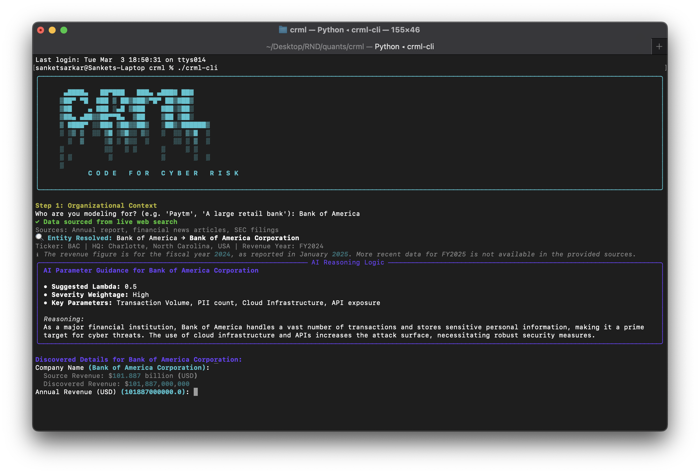

# CRML Code — AI-Powered Cyber Risk CLI

[](https://www.python.org/downloads/)
[](https://opensource.org/licenses/MIT)
[](https://openai.com/)

> An interactive terminal tool for end-to-end cyber risk modeling — no YAML, no spreadsheets, no proprietary tools.

**CRML Code** turns a company name or a vulnerability scan report into a full quantitative risk assessment. It uses OpenAI GPT-4o to discover risk scenarios, run Monte Carlo simulations, benchmark against industry peers, and generate executive-ready reports — all in your terminal.



---

## What it does

```
Step 1   Org Context    →  Auto-discovers company profile (revenue, industry, compliance) via live web search
Step 2   Risk Discovery →  Groups findings into 3–5 named risk scenarios using GPT-4o
Step 3   Simulation     →  Runs 10,000 Monte Carlo trials across 3 distribution variants per scenario
Step 3b  Control ROI    →  Maps security controls to scenarios, calculates net savings and ROI %
Step 4   Report         →  Generates a Markdown + styled HTML executive underwriting report
         What-If Mode   →  Interactively tweak lambda / median / sigma and see EAL change instantly
```

---

## Quick setup

```bash
# 1. Clone and enter the repo
git clone https://github.com/Faux16/crml.git && cd crml

# 2. Create a virtual environment
python3 -m venv .venv && source .venv/bin/activate

# 3. Install dependencies
pip install -e ./crml_lang -e ./crml_engine
pip install openai rich pyyaml python-dotenv

# 4. Make the CLI executable
chmod +x crml-cli

# 5. Save your OpenAI API key once
./crml-cli --configure

# 6. Run
./crml-cli
```

---

## Bring Your Own Key (BYOK)

CRML Code does **not** ship with or require a shared API key. You provide your own OpenAI key. It is resolved in this order:

| Priority | Method | How |
|----------|--------|-----|
| 1 | CLI flag | `./crml-cli --api-key sk-...` |
| 2 | Environment variable | `export OPENAI_API_KEY=sk-...` |
| 3 | Saved config | `./crml-cli --configure` (stored in `~/.crml/config.json`) |
| 4 | Interactive prompt | Just run `./crml-cli` — it will ask |

Keys saved via `--configure` are stored in `~/.crml/config.json`, outside the project directory and never committed to git.

---

## Usage

```bash
# Interactive mode
./crml-cli

# Save / update your API key
./crml-cli --configure

# Load a vulnerability scan report (JSON or CSV)
./crml-cli --scan /path/to/report.json

# One-time key override
./crml-cli --api-key sk-your-key-here
```

### Scan file format

**JSON:**
```json
[
  { "vulnerability": "SQL Injection", "severity": "Critical", "asset": "web-app-01" },
  { "vulnerability": "Unpatched OpenSSL", "severity": "High", "asset": "api-server-02" }
]
```

**CSV:**
```csv
vulnerability,severity,asset
SQL Injection,Critical,web-app-01
Unpatched OpenSSL,High,api-server-02
```

---

## Output files

All outputs are saved to `output/<org_slug>/`:

| File | Contents |
|------|----------|
| `portfolio.yaml` | All scenario models in CRML format |
| `CRML_RISK_REPORT.md` | Executive underwriting report (Markdown) |
| `CRML_RISK_REPORT.html` | Executive underwriting report (styled HTML) |
| `benchmark.json` | Industry peer comparison data |
| `control_roi.json` | Control ROI analysis |
| `session_history.json` | Risk trend across runs (for the same org) |
| `session_log.txt` | Timestamped session event log |

---

## Flags

| Flag | Short | Description |
|------|-------|-------------|
| `--api-key KEY` | `-k` | OpenAI API key (overrides env and config) |
| `--scan FILE` | `-s` | Path to vulnerability scan report (`.json` or `.csv`) |
| `--configure` | — | Save or update your API key and exit |
| `--help` | `-h` | Show help |

---

## Full documentation

See [wiki/Guides/CLI.md](wiki/Guides/CLI.md) for the complete reference — including workflow details, MITRE ATT&CK tagging, What-If mode, architecture, and troubleshooting.

---

## License

MIT — see [LICENSE](LICENSE).
